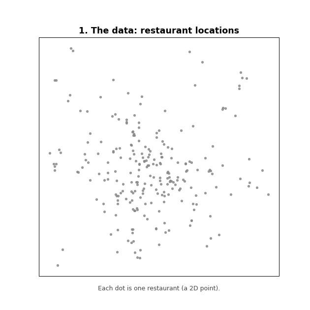

# R-tree STR Bulk Loading & Incremental k-NN Search

A two-part spatial indexing project for the **Complex Data Management** course.
It builds an **R-tree** over a 2D point dataset using the **Sort-Tile-Recursive (STR)**
bulk-loading algorithm, and then performs **incremental k-Nearest-Neighbor (k-NN)**
queries on the resulting tree using a best-first search.

The dataset used is a set of restaurant locations in Beijing (`Beijing_restaurants.txt`).

## Overview

The project is split into two independent scripts:

- **`build_rtree_str.py`** (Part 1) — Builds the R-tree from raw 2D points using STR
  bulk loading and serializes it to a text file.
- **`incremental_knn.py`** (Part 2) — Reads the serialized R-tree back into memory and
  answers k-NN queries for a given query point.

## What is an R-tree? (animated demo)

An **R-tree** indexes spatial data by wrapping nearby points in **Minimum Bounding
Rectangles (MBRs)** — boxes inside boxes. The animation below (built from a real sample
of the dataset) walks through the whole idea: grouping points into leaves, wrapping
leaves into parent nodes up to the root, and finally running an incremental k-NN search
that grows a radius around the query point and prunes boxes that are too far away.



> Regenerate the GIF anytime with `python make_rtree_animation.py`.

## Part 1 — Building the R-tree (STR bulk loading)

`build_rtree_str.py` implements the Sort-Tile-Recursive packing strategy:

1. **Read points** from the input dataset (first line = number of records `r`,
   each following line = `x y` coordinates).
2. **Sort all points by x**.
3. **Split into vertical slices** and **sort each slice by y**, so points are packed
   in spatially close groups.
4. **Create leaf nodes** by taking `n` consecutive points per leaf, where
   `n = floor(CAPACITY / LEAF_SIZE)`.
5. **Build the upper levels recursively** (`create_upper_levels`), packing
   `cap_per_node = floor(CAPACITY / NON_LEAF_SIZE)` entries into each internal node,
   until a single **root** remains.
6. **Print statistics** per level (number of nodes and average MBR area).
7. **Serialize** the whole tree to a text file.

Key sizing constants (top of the file):

| Constant        | Value | Meaning                                |
|-----------------|-------|----------------------------------------|
| `CAPACITY`      | 1024  | Disk page / node capacity (bytes)      |
| `LEAF_SIZE`     | 20    | Size of a leaf entry `<record_id, point>` |
| `NON_LEAF_SIZE` | 36    | Size of an internal entry `<node_id, mbr>` |

### Core classes

- **`LeafNode`** — A leaf whose entries are `(record_id, (x, y))` points. Its MBR is
  computed from its points; its area is `0`.
- **`Node`** — An internal node whose entries are `(node_id, (min_x, min_y, max_x, max_y))`.
  It can compute its MBR and the average area of its children.
- **`RTree`** — Orchestrates the whole build: inserts leaves, recursively builds the
  internal levels up to the root, computes per-level statistics, and writes the tree
  to disk.

### Output file format

The first line is the **root node id**. Every other line describes one node:

```
node_id, num_entries, is_leaf, (ptr, geometry), (ptr, geometry), ...
```

- `is_leaf = 1` → leaf node, geometry is a point `(x, y)`.
- `is_leaf = 0` → internal node, geometry is an MBR `[min_x, min_y, max_x, max_y]`.

### Usage

```bash
python build_rtree_str.py rtree_file.txt
```

> Note: the input dataset path (`Beijing_restaurants.txt`) is currently hard-coded in
> the script. Place the dataset in the same directory before running.

## Part 2 — Incremental k-NN search

`incremental_knn.py` reconstructs the tree from the file produced in Part 1 and runs a
**best-first (incremental nearest-neighbor) search** using a priority queue (`heapq`).

### How it works

1. **Parse the R-tree file** (`read_rtree` / `extract_entries`): each line is split into
   a *prefix* (`node_id, n, is_leaf`) and the *entries* part, which is then carefully
   parsed back into tuples.
2. **Distance functions**:
   - `min_dist_of_points` — Euclidean distance between two points.
   - `mindist` — minimum distance between the query point and a node's MBR.
3. **Best-first traversal** (`bfs` / `incremental_nearest_neighbors`): starting from the
   root entries, a min-heap of `(distance, node_id, is_leaf)` is repeatedly popped.
   Internal entries are expanded (their children pushed onto the heap), while leaf points
   are reported as neighbors in increasing order of distance.
4. The search returns the `k` nearest neighbors (the implementation also retrieves a few
   extra neighbors beyond `k`).

### Usage

```bash
python incremental_knn.py rtree_file.txt q_x q_y k
```

- `rtree_file.txt` — the file produced by Part 1.
- `q_x`, `q_y` — coordinates of the query point.
- `k` — number of nearest neighbors to return.

Example:

```bash
python incremental_knn.py rtree_file.txt 116.40 39.90 5
```

## Project structure

```
.
├── build_rtree_str.py       # Part 1: STR bulk-loading R-tree builder
├── incremental_knn.py       # Part 2: incremental k-NN search
├── make_rtree_animation.py  # Generates the README demo GIF
├── Beijing_restaurants.txt  # Input dataset (points)
├── rtree_demo.gif           # Animated explainer used in this README
├── report.pdf               # Detailed report (in Greek)
└── README.md
```

## Requirements

- Python 3.x for the two main scripts (standard library only — `math`, `heapq`, `re`, `sys`).
- For regenerating the demo GIF (`make_rtree_animation.py`): `matplotlib` and `pillow`.

```bash
pip install matplotlib pillow
```

